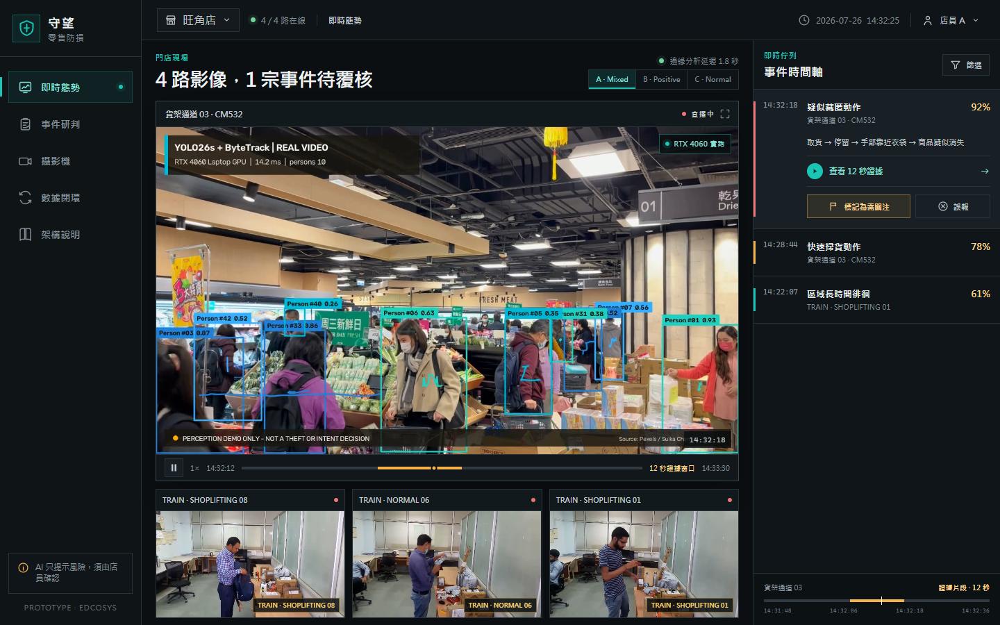
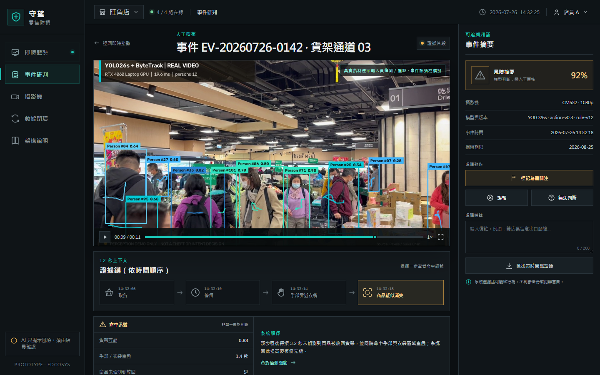
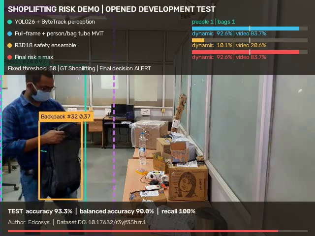
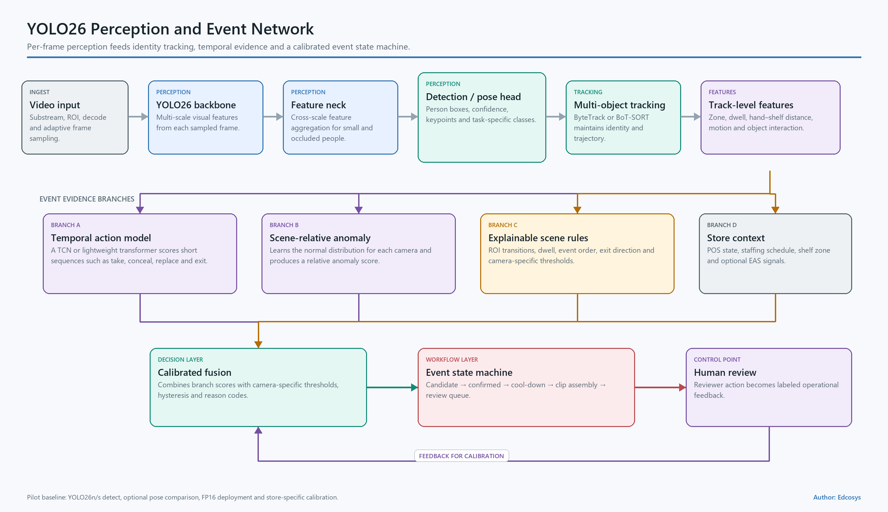
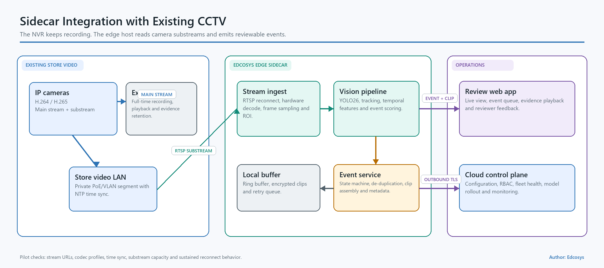

# Edcosys CCTV Retail Loss Prevention Prototype

Author: Edcosys

This repository contains an interactive retail loss-prevention prototype, a real-video YOLO26s + ByteTrack GPU demo, UI screenshots, architecture diagrams, reproducible scripts, validation evidence, and an English implementation proposal.



## Deliverables

| Deliverable | Path |
|---|---|
| English proposal — editable Word file | `Edcosys_CCTV_Retail_Loss_Prevention_Proposal_EN.docx` |
| English proposal — reviewed PDF | `Edcosys_CCTV_Retail_Loss_Prevention_Proposal_EN.pdf` |
| Interactive React/Vite prototype | `src/` |
| Live operations screenshot | `design/prototype-live.png` |
| Event review screenshot | `design/prototype-review.png` |
| Architecture screenshot | `design/prototype-architecture.png` |
| Mobile screenshot | `design/prototype-mobile.png` |
| Dataset camera-set screenshots | `design/prototype-live.png`, `design/dataset-camera-set-*.png` |
| Training-video UI previews | `public/assets/cctv/training/` |
| YOLO26 boxed training videos | `public/assets/video/training-boxed/` |
| Real-video YOLO26 demo | `public/assets/video/yolo26-retail-demo.mp4` |
| YOLO26 shoplifting v2 demo | `public/assets/video/shoplifting-yolo26-v2-demo.mp4` |
| YOLO26 shoplifting v2 benchmark | `docs/results/shoplifting-yolo26-v2/BENCHMARK.md` |
| Shoplifting benchmark demo | `public/assets/video/shoplifting-mil-heldout-demo.mp4` |
| Measured shoplifting benchmark | `docs/results/shoplifting/BENCHMARK.md` |
| Actor/clothing-disjoint split | `docs/results/shoplifting/actor-clothing-disjoint-split.csv` |
| Local GPU metrics | `assets/video/yolo26-run-metrics.json` |
| Reproducible inference script | `scripts/run_yolo_retail_demo.py` |
| Reproducible shoplifting benchmark | `scripts/shoplifting_mil_baseline.py` |
| YOLO26-MViT experiment | `scripts/shoplifting_yolo_mvit_experiment.py` |
| Recall-first ensemble packager | `scripts/shoplifting_recall_ensemble.py` |
| ML environment pins | `requirements-ml.txt` |
| English architecture diagrams | `docs/diagrams/en/` |
| Frontend QA results | `docs/frontend-qa-results.json` |

## Prototype

```powershell
pnpm install
pnpm run dev
```

Open `http://127.0.0.1:5173`.

Production build and preview:

```powershell
pnpm run build
pnpm run preview -- --port 4173
```

The prototype provides:

- live camera operations;
- event triage and short evidence playback;
- structured reviewer decisions and notes;
- camera and model version metadata;
- a sidecar integration view for an existing NVR;
- desktop and mobile layouts.

The live view includes three selectable camera-preview sets built from nine
videos in the actor/clothing-disjoint training split: A Mixed, B Positive, and
C Normal. Each tile is a real six-second dataset clip with a visible training
label and source record.



## Real-video YOLO26 GPU demo

The recorded run used:

- NVIDIA GeForce RTX 4060 Laptop GPU;
- YOLO26s person detection;
- ByteTrack multi-object tracking;
- CUDA FP16 inference at 640-pixel input;
- 171 processed frames at 15 FPS output;
- 16.66 ms p50 and 32.91 ms p95 measured inference latency;
- 15.65 FPS complete processing pipeline including decode, resize, inference, tracking, drawing, and intermediate video writing.

Run the demo:

```powershell
.\.venv-yolo\Scripts\python.exe .\scripts\run_yolo_retail_demo.py
```

The script reads `assets/video/pexels-hong-kong-supermarket.mp4` and writes `public/assets/video/yolo26-retail-demo.mp4`.

This run measures person detection, tracking, rendering, and local GPU throughput. Shoplifting event accuracy requires labeled action sequences and a store acceptance set.

## YOLO26 shoplifting benchmark v2

The v2 pipeline uses YOLO26s to detect people and nearby bags, builds a
person/bag tube for every temporal window, and fuses that view with full-frame
MViT features. A recall-first safety ensemble takes the maximum of the
YOLO26-MViT and R3D-18 MIL probabilities at the fixed 0.50 threshold.

Opened internal test result:

| Videos | Accuracy | Balanced accuracy | Precision | Recall | Specificity | F1 | ROC-AUC |
|---:|---:|---:|---:|---:|---:|---:|---:|
| 30 | **93.3%** | **90.0%** | 90.9% | **100.0%** | 80.0% | 95.2% | 94.5% |



The confusion matrix is TN 8, FP 2, FN 0, TP 20. The test split was opened
during this development round, so 93.3% is a development benchmark. A new
sealed store/camera/day holdout is required for the final generalization claim.
See
[`docs/results/shoplifting-yolo26-v2/BENCHMARK.md`](docs/results/shoplifting-yolo26-v2/BENCHMARK.md)
for component metrics, uncertainty, provenance, and per-video predictions.

Reproduce the pipeline after placing the dataset under
`data/shoplifting-video-dataset` and YOLO26s weights at `models/yolo26s.pt`:

```powershell
.\.venv-yolo\Scripts\python.exe -m pip install -r requirements-ml.txt
.\.venv-yolo\Scripts\python.exe scripts\create_shoplifting_split_manifest.py
.\.venv-yolo\Scripts\python.exe scripts\shoplifting_mil_baseline.py run
.\.venv-yolo\Scripts\python.exe scripts\shoplifting_yolo_mvit_experiment.py run
.\.venv-yolo\Scripts\python.exe scripts\shoplifting_yolo_mvit_experiment.py evaluate --include-test
.\.venv-yolo\Scripts\python.exe scripts\shoplifting_recall_ensemble.py
.\.venv-yolo\Scripts\python.exe scripts\render_shoplifting_yolo26_v2_demo.py
```

The v2 H.264 demo is
[`public/assets/video/shoplifting-yolo26-v2-demo.mp4`](public/assets/video/shoplifting-yolo26-v2-demo.mp4).
The original frozen R3D-18 benchmark remains available at
[`docs/results/shoplifting/BENCHMARK.md`](docs/results/shoplifting/BENCHMARK.md).

## Proposed model pipeline



1. Ingest an authorized RTSP substream.
2. Detect people, relevant objects, and optional pose keypoints with YOLO26.
3. Maintain per-camera tracks with ByteTrack or BoT-SORT.
4. Compute track-level zone, dwell, hand–shelf distance, motion, and interaction features.
5. Score short sequences with a temporal model and camera-specific rules.
6. Create an evidence clip and reason codes.
7. Send the event to staff review.
8. Store reviewer feedback for calibration and controlled model updates.

## Dataset strategy

The public-data plan combines:

- the [Shoplifting Video Dataset](https://www.kaggle.com/datasets/kipshidze/shoplifting-video-dataset) for an initial two-class temporal classifier and pipeline tests;
- RetailAction for person–shelf–item interaction;
- PoseLift for pose, tracks, boxes, and frame-level retail actions;
- UCF-Crime and DCSASS for broader anomaly baselines;
- store-specific continuous normal video, controlled events, hard negatives, and a frozen acceptance set.

The Kaggle Shoplifting Video Dataset is a re-upload of [Mendeley Data DOI 10.17632/r3yjf35hzr.1](https://data.mendeley.com/datasets/r3yjf35hzr/1). It uses CC BY 4.0, 640×480 video at 30 FPS, and clip-level `Normal` / `Shoplifting` labels. Training and evaluation splits should separate actors, recording sessions, and backgrounds.

## Existing CCTV integration



The proposed pilot keeps the existing NVR recording path. An Edcosys edge sidecar reads approved camera substreams, runs the vision pipeline, buffers short clips, and sends reviewable events to the operations UI.

Recommended first deployment:

- one store;
- 2–4 high-loss camera views;
- 10–14 weeks;
- read-only sidecar integration;
- shadow-mode measurement before operational alerts;
- KPI gate based on event recall, false alerts per camera-hour, latency, uptime, and reviewer workload.

## Video source

The real supermarket footage was created by Suika Chan and published on Pexels:

- [Customers Shopping at Supermarket](https://www.pexels.com/video/customers-shopping-at-supermarket-10901926/)
- [Pexels license](https://www.pexels.com/license/)

The source footage shows ordinary supermarket customers. The interface event sequence is a workflow simulation. Full source notes are in `public/assets/video/SOURCES.md`.
