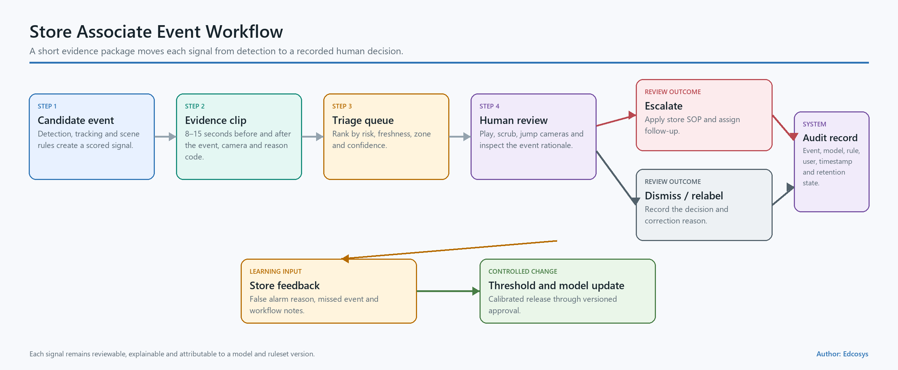
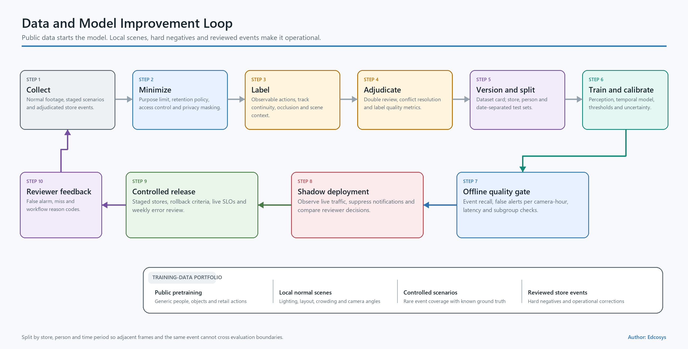
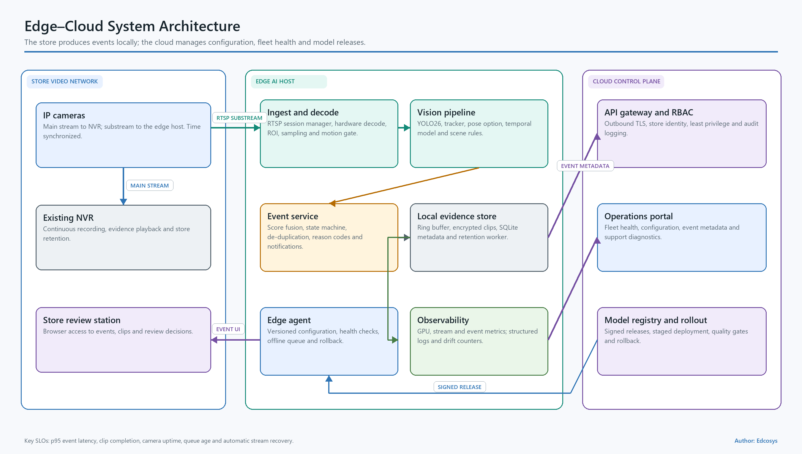

# CCTV Retail Loss Prevention

## YOLO26 Feasibility, Dataset Strategy, and Pilot Proposal

| Item | Proposal |
|---|---|
| Author | **Edcosys** |
| Version | v1.0 English Proposal |
| Date | 27 July 2026 |
| Recommended first deployment | One store, 2–4 cameras, one sidecar AI edge server |
| Pilot duration | 10–14 weeks |
| Primary decision | Approve a measured pilot using YOLO26 as the visual perception layer |

> **Operating principle:** The system creates reviewable alerts from observable actions. Store staff make the operational decision using the video clip, live context, and store procedures.

---

## 1. Executive Proposal

Edcosys recommends a 10–14 week pilot in one store using 2–4 existing CCTV channels. The existing NVR continues continuous recording. A separate edge server reads authorized RTSP or ONVIF streams, performs inference, creates short evidence clips, and sends alerts to a staff review interface.

YOLO26 is suitable for person detection, object detection, pose estimation, and edge deployment. A retail loss-prevention event develops across several seconds, so the production pipeline combines five components:

1. YOLO26 detection and pose features;
2. person and object tracking;
3. camera-specific shelf and checkout zones;
4. a temporal action model and calibrated scene rules; and
5. staff review with structured feedback.

The proposed pilot answers four commercial questions:

- Can the existing cameras provide usable views of hands, products, bags, and shelf interaction?
- Can the complete edge pipeline operate reliably on 2–4 channels?
- Can event-level recall and false-alert volume meet the store’s operating threshold?
- Can staff review each alert quickly and follow a safe, auditable workflow?

The latest requirement identifies `NVR4216-16P-4KS3`, `IPC-HDBW2249E-S-IL`, `IPC-HDBW1230E`, and `IPC-HDBW1239V-A`.[S1] These model numbers map to Dahua product families. The NVR and the first two camera families publish H.265/H.264, ONVIF, RTSP, dual-stream, CGI, or SDK capabilities that support a sidecar integration design.[S2][S3][S4]

The pilot begins with a stream and image-quality audit. It then establishes a person/pose/tracking baseline, builds a store-specific action dataset, trains the temporal event layer, and runs in shadow mode. Expansion to 8 or 16 channels follows the KPI decision gate in Section 10.

### 1.1 Recommended decision

**Proceed with a controlled pilot.**

| Decision element | Recommendation |
|---|---|
| Store scope | One store |
| Camera scope | 2–4 high-loss areas with the clearest views |
| Integration | Read-only sidecar connection to the existing CCTV system |
| AI scope | Detection, pose, tracking, observable action sequence, evidence clip |
| Review | Staff confirms, dismisses, or marks the event as unclear |
| Data | Public datasets for method development; store footage for acceptance |
| Scale gate | Event recall, false alerts per camera-hour, latency, uptime, and staff workload |

### 1.2 Pilot outcome

The pilot delivers a quantified Go, Conditional Go, or Redesign decision. The decision includes camera-by-camera performance, operating workload, edge hardware capacity, privacy controls, and a deployment plan for additional channels.

---

## 2. User Needs and Operating Workflow

### 2.1 Current need

The original requirement asked for a record and host notification when a person passes a camera. The latest request expands this into suspicious shopper action detection and storekeeper warning.[S1]

The product therefore needs two levels:

| Level | User need | Output |
|---|---|---|
| L0: presence and zone event | Record a person entering or dwelling in an area | Time, camera, track, zone event |
| L1/L2: retail behavior event | Surface a sequence that deserves staff attention | Short clip, observed signals, risk level, review action |

The system observes actions that can be labeled consistently:

- a hand enters a shelf zone;
- an item is picked up, held, returned, or becomes occluded;
- a hand moves toward a bag or clothing area;
- a person repeatedly approaches the same high-loss area;
- a rapid multi-item sweep occurs;
- a shopper moves from a shelf toward checkout or exit;
- the available evidence remains unclear.

Payment verification becomes a later product layer using POS, item-state, exit, or EAS events. The first pilot concentrates on camera-visible action sequences and the staff review workflow.

### 2.2 Primary users

| User | Core task | Information required |
|---|---|---|
| Store associate or security staff | Review alerts and observe the live situation | Camera, time, clip, observable signals, event status |
| Store manager | Manage workload and recurring loss patterns | Daily alert volume, confirmed rate, review time, camera health |
| System administrator | Maintain streams, access, storage, and versions | Device health, GPU load, disk, model version, audit log |
| Model and data team | Improve event quality | Approved labels, camera context, errors, model outputs |
| Privacy or compliance owner | Govern purpose, access, retention, and deletion | Data flow, PIA, retention rules, access/export/delete records |

### 2.3 Staff event workflow



1. The camera or NVR supplies a read-only video stream.
2. The edge server detects people and relevant objects, estimates pose, and maintains temporary tracks.
3. The temporal event layer combines shelf interaction, hand movement, dwell, item-state, and camera rules.
4. A trigger captures an 8–15 second evidence clip and creates one deduplicated event.
5. The staff interface displays the event, observed signals, and current camera context.
6. The reviewer selects **Needs attention**, **False alert**, or **Unclear**, then adds an optional note.
7. The event record stores the reviewer action, model version, rule version, threshold version, and timestamps.

The store’s safety procedure governs any action after review. The UI uses the phrase **observable behavior alert — staff review required**.

### 2.4 Questions resolved during kickoff

- Which concealment, sweep, checkout, and exit scenarios create the highest operational value?
- Which 2–4 cameras cover the highest-loss zones?
- Which endpoint receives alerts: store PC, mobile web app, local pop-up, email, or webhook?
- Which POS, EAS, and item-master signals are available?
- Which historical incidents have approved use for evaluation?
- Which retention, export, and access policies apply to event clips?
- Which store role owns the final event disposition?

---

## 3. Proposed Solution

### 3.1 Product capability layers

| Layer | Capability | Main implementation | Pilot role |
|---|---|---|---|
| L0 | Person presence, zone entry, line crossing, dwell | Existing NVR analytics and YOLO26 detection | Connectivity and alert baseline |
| L1 | Shelf interaction, hand-to-bag/clothing proximity, repeated handling | YOLO26 detection/pose, tracker, camera rules | Explainable observable signals |
| L2 | Multi-second risk sequence | Temporal convolution or lightweight Transformer, anomaly baseline, calibrated fusion | Primary pilot event model |
| L3 | Item-to-payment evidence chain | Item tracking, virtual basket, POS/EAS and exit integration | Follow-on scope after L2 |

### 3.2 Sidecar deployment


The edge server operates beside the existing recording system:

- the NVR remains the continuous recording and playback system;
- the AI server receives read-only main or sub-streams;
- the stream gateway handles reconnects, decoding, timestamps, and camera health;
- a short encrypted ring buffer retains only the video needed to create an event clip;
- the local API stores event metadata, review status, and audit history;
- the web application provides live status and event review;
- approved notifications leave the edge server through a controlled adapter.

This structure limits operational disruption and provides a clean rollback path. An AI service failure leaves NVR recording active.

### 3.3 Existing camera and NVR compatibility

| Equipment | Published capability | Pilot action |
|---|---|---|
| `DHI-NVR4216-16P-4KS3` | 16 channels, H.265/H.264, ONVIF Profile S/G/T, CGI and SDK; published incoming/recording bandwidth up to 160 Mbps with AI disabled.[S2] | Validate firmware, outbound bandwidth, read-only account, stream URL, and PoE network routing |
| `IPC-HDBW2249E-S-IL` | 2 MP, 1080p at 25/30 fps, dual streams, H.265/H.264, RTSP, ONVIF, intrusion/tripwire and SMD functions.[S3] | Test sub-stream for continuous analysis and main-stream ROI for event confirmation |
| `IPC-HDBW1230E` family | 2 MP, 1080p at 25/30 fps, dual streams, H.265/H.264, RTSP and ONVIF; some variants are discontinued.[S4] | Record exact suffix and firmware; audit low light, occlusion, and maintainability |
| `IPC-HDBW1239V-A` | Requirement contains an incomplete or unverified suffix.[S1] | Photograph the product label and obtain the matching datasheet |
| Xiaomi candidate | Xiaomi’s C300 support page states that the model lacks ONVIF support.[S10] | Evaluate only an exact model with a supported RTSP, ONVIF, or vendor SDK path |

### 3.4 Camera acceptance criteria

Each candidate view receives a short pixel and occlusion audit:

- person height and hand visibility at the target shelf;
- product size at the working resolution;
- camera height, angle, motion blur, reflection, backlight, and night mode;
- shelf and bag occlusion;
- frame rate, keyframe interval, bitrate, timestamp stability, and dropped frames;
- staff, replenishment, baskets, phones, strollers, children, and crowding as hard-negative conditions.

The first 2–4 channels come from views with strong hand-and-shelf visibility and clear operating value.

---

## 4. YOLO26 Fit and Model Architecture

### 4.1 Role of YOLO26

YOLO26 supplies the real-time visual feature layer:

- person, bag, basket, and selected product-class detection;
- human pose and keypoint estimation;
- multi-scale features for people and smaller retail objects;
- ONNX, TensorRT, OpenVINO, and other deployment exports;
- a one-to-one end-to-end detection head for NMS-free inference, with a one-to-many path available for deployment trade-offs.[S5][S6][S8]

The official architecture uses C3k2, SPPF, and C2PSA feature extraction with FPN/PAN multi-scale fusion and an anchor-free decoupled head. YOLO26 removes DFL from box regression and supports detection, pose, segmentation, and classification tasks.[S5][S6]

The complete event model adds:

- ByteTrack or BoT-SORT for track continuity;[S7]
- per-person pose velocity and hand-to-zone distances;
- shelf dwell and repeated-interaction features;
- item visible/occluded/returned state;
- a 2–8 second temporal model;
- camera-specific rules, hysteresis, cooldown, and event deduplication;
- evidence capture and staff disposition.


### 4.2 Network flow

```text
H.265/H.264 stream
    → hardware decode and frame sampling
    → YOLO26 detect + pose
    → ByteTrack/BoT-SORT
    → per-track retail interaction features
    → temporal action model + anomaly model + scene rules
    → calibrated event score and state machine
    → 8–15 second evidence clip
    → staff review and feedback
```

Bounding boxes locate visible entities. Pose features describe body motion. Tracking links observations across frames. The temporal layer represents sequences such as pick-up, dwell, hand-to-bag movement, and missing return evidence.

### 4.3 Official YOLO26 reference metrics

Ultralytics publishes the following COCO object-detection results at 640-pixel input under its specified benchmark environments.[S5]

| Model | Parameters | FLOPs | COCO mAP50–95 | End-to-end mAP50–95 | T4 TensorRT 10 latency |
|---|---:|---:|---:|---:|---:|
| YOLO26n | 2.4M | 5.4B | 40.9 | 40.1 | 1.7 ms |
| YOLO26s | 9.5M | 20.7B | 48.6 | 47.8 | 2.5 ms |
| YOLO26m | 20.4M | 68.2B | 53.1 | 52.5 | 4.7 ms |

These figures benchmark general object detection. The store pilot evaluates the full video pipeline and event-level retail behavior metrics separately.

### 4.4 Pilot model plan

1. Benchmark YOLO26n and YOLO26s detection on the selected cameras.
2. Benchmark YOLO26n-pose and YOLO26s-pose for keypoint stability under shelf occlusion.
3. Run FP16 first and test INT8 with a representative store calibration set.
4. Train custom bag, basket, high-value product-group, and shelf-interaction features where the camera view supports them.
5. Compare a rules baseline, pose anomaly baseline, temporal convolution network, and lightweight Transformer.
6. Calibrate each camera independently and record the threshold version with every event.

Ultralytics publishes YOLO26 under AGPL-3.0 and Enterprise options. Commercial distribution requires the selected software architecture and license to be reviewed before production release.[S5]

---

## 5. Data Strategy

### 5.1 Public dataset assessment

| Dataset | Published scope | Use in this project | License and domain action |
|---|---|---|---|
| **Shoplifting Video Dataset** | Public catalogs report 182 MP4 clips at 640×480 and 30 fps, organized into clip-level `Normal` and `Shoplifting` classes. The source describes simulated actions recorded in a computer-vision laboratory.[S36] | Warm-start a two-class temporal classifier, test clip sampling, and establish a reproducible PoC baseline | CC BY 4.0; split by actor, recording session, and background; add event boundaries, tracks, boxes, and hard negatives |
| **RetailAction** | 21,000 samples, about 41 hours, 10 real stores, synchronized overhead views, and take/put/touch labels.[S24] | Strong starting point for person–shelf–item interaction and occlusion research | Preserve de-identification and attribution; review the custom commercial terms before use |
| **PoseLift** | The paper reports 155 sequences from six overhead retail cameras at 1080p/15 fps, including 43 shoplifting sequences; the repository provides pose, boxes, tracks, and frame labels.[S11][S12] | Closest public pose-based baseline for concealment-style action | Verify the downloaded manifest and dataset terms; use as a method benchmark |
| **UCF-Crime** | 1,900 long videos, about 128 hours, 13 anomaly classes including shoplifting.[S14] | General weakly supervised video anomaly pretraining and stress testing | Keep results separate from store acceptance because camera and scene domains vary |
| **DCSASS** | 16,853 clips derived from UCF-Crime: 9,676 normal and 7,177 abnormal; Kaggle lists CC BY-NC-SA 4.0.[S15] | Fast research classifier baseline | Keep the dataset outside commercial model weights |
| **CHAD** | Four high-resolution cameras, more than 1.15 million frames, 22 anomaly types, boxes, identities, pose, and frame labels.[S16] | Pose, tracking, and anomaly robustness test | Treat the parking-lot scene as an external-domain test |
| **Open Images V7** | About 9 million images; around 1.9 million images contain roughly 16 million boxes across 600 classes.[S25] | General objects such as people, bags, backpacks, bottles, and packaged goods | Check each image’s source license before training or redistribution |

Public data establishes model and pipeline baselines. Store-specific data controls final calibration and acceptance. The Shoplifting Video Dataset supplies clip-level temporal-classification labels. YOLO detection boxes and precise event timing require an additional annotation pass.

### 5.2 Store dataset plan

| Data category | Pilot target | Purpose |
|---|---:|---|
| Continuous normal operation | 200–500 camera-hours | Capture peak/off-peak traffic, restocking, phone use, bags, clothing adjustment, reflections, and occlusion |
| Controlled positive events | 300–600 events | Cover different people, clothing, bag types, product sizes, cameras, successful/failed concealment, and item return |
| Hard negatives | 3–5 times the positive candidate count | Train against normal actions that resemble concealment |
| Approved historical events | All legally approved usable cases | Provide realistic case review while keeping a separate report |
| Frozen acceptance set | At least 2 cameras, 100+ normal camera-hours, and 100+ controlled positive events | Produce the Go/Conditional Go/Redesign result |

*All values in this table are pilot planning targets. Phase 0 finalizes them after the camera and data audit.*

### 5.3 Annotation model

Each event record contains:

- `store_id`, `camera_id`, `event_id`, start time, and end time;
- a temporary single-camera `track_id`;
- shelf interaction, pick-up, put-back, hand-near-bag, hand-near-clothing, occlusion, dwell, and movement-zone labels;
- `normal`, `observable_risk_sequence`, or `unclear`;
- shelf, checkout, exit, staff, and replenishment zones;
- video-quality, person-size, product-size, lighting, and occlusion tags;
- two annotators plus adjudication for disputed labels;
- model, rule, threshold, dataset, and reviewer versions.

Face embeddings and sensitive-attribute labels remain outside the pilot data model.

### 5.4 Evaluation split and quality controls

- Split by participant, date, event, and camera.
- Keep adjacent frames from one event in a single split.
- Freeze the final test set before threshold tuning.
- Report results for each camera and each occlusion group.
- Preserve continuous normal periods to measure false alerts per camera-hour.
- Separate controlled events from historical real events.
- Report event precision, event recall, alert latency, review workload, and 95% confidence intervals.
- Maintain a dataset card, manifest, source license, annotation guide, and change history.



---

## 6. Reference Products and Implementation Patterns

The strongest products combine existing CCTV integration, short evidence clips, human review, and store-specific deployment.

| Product or platform | Public implementation pattern | Public adoption statement | Pattern used in this proposal |
|---|---|---|---|
| **Veesion** | Existing CCTV, body-gesture analysis, mobile video alerts, and staff review; the company states that it avoids facial recognition.[S17] | Veesion states 6,000+ stores in 55+ countries; a ShopRite testimonial reports a 43% shrink reduction.[S17] | Short clip, observable gesture, human review, fast retrofit |
| **Everseen / Evershelf / Evercheck** | Shelf and checkout computer vision with real-time alerts and operational analytics.[S18] | Everseen states deployment in 10,000+ stores and 150,000 checkout lanes.[S18] | Separate shelf and checkout workflows; start with high-value/high-loss areas |
| **Trigo Loss Prevention** | Existing CCTV plus POS, anonymous shopper-to-product tracking, virtual basket, and video evidence.[S19] | Trigo describes single-store testing followed by retailer expansion.[S19] | Use item-to-payment evidence as the L3 roadmap |
| **Scylla Retail Security** | Existing VMS/camera integration and real-time suspicious-shopping alerts.[S21] | The vendor publishes product accuracy and false-alert filtering statements.[S21] | Local integration, event filtering, operational alert flow |
| **Axis Object Analytics** | Edge person/vehicle classification, zones, line crossing, dwell, counts, and scene metadata.[S29] | Axis documents the product and structured metadata interface.[S29] | Decouple camera metadata from downstream event applications |
| **NVIDIA DeepStream** | Source, decode, mux, inference, tracking, analytics, and message-broker graph.[S30] | NVIDIA maintains a multi-stream reference architecture.[S30] | Hardware decoding, batched inference, metadata transport, and deployment observability |
| **BriefCam / Frigate** | Searchable metadata and event review; Frigate uses a recording stream, lower-rate detection stream, tracking, zones, and MQTT.[S31][S32] | Commercial and open-source examples of event-driven video operations.[S31][S32] | Main stream for evidence, sub-stream for analysis, local operation, searchable events |

Supplier deployment and outcome figures provide product references. Pilot KPIs remain the acceptance basis for this project.

### 6.1 Product principles

1. Reuse the installed CCTV estate through a separate computing layer.
2. Send an evidence clip with each alert.
3. Describe the actions visible in the clip.
4. Begin with 2–4 high-loss views.
5. Design the store review process alongside the model.
6. Record every reviewer outcome for error analysis and controlled retraining.
7. Add POS and item-state evidence when the business requests payment verification.

---

## 7. System and Network Architecture

### 7.1 End-to-edge architecture



```text
IP Cameras / Existing NVR
        │ read-only RTSP / ONVIF
        ▼
Stream Gateway
  decode • timestamps • reconnect • health • frame sampling
        ▼
Inference Runtime
  YOLO26 detect/pose • tracker • temporal model
        ▼
Event Engine
  zones • fusion • thresholds • cooldown • deduplication
        ├─────────────► Encrypted ring buffer / evidence clip
        ▼
Local API and Event Database
        ├─────────────► Web/PWA review interface
        ├─────────────► Local pop-up / email / webhook adapter
        └─────────────► Audit, retention, deletion, health metrics

Optional outbound-only control plane:
signed model/configuration packages • minimal health telemetry • rollback
```

### 7.2 Component responsibilities

| Component | Responsibility | Production control |
|---|---|---|
| Stream gateway | RTSP/ONVIF ingest, decode, reconnect, timestamps, frame sampling | Read-only credentials, backoff, camera health, bounded queues |
| Inference runtime | YOLO26 detection/pose, tracking, temporal model | Versioned model, GPU limits, deterministic configuration |
| Event engine | Zones, signal fusion, thresholds, cooldown, deduplication | Camera-specific configuration and signed release |
| Ring buffer | Pre-event and post-event video capture | Encryption, bounded size, retention expiry |
| Event API/database | Metadata, status, reviewer action, search | RBAC, TLS, audit, backup and restore |
| Web/PWA interface | Live health, evidence playback, event disposition | Role-based views, session timeout, visible model/event context |
| Notification adapter | Local UI, webhook, email, or approved channel | Rate limits, retries, escalation policy |
| Health agent | Stream uptime, GPU, decode, disk, queue, latency | Alerting, dashboard, incident runbook |
| Optional control plane | Model/configuration registry and minimal telemetry | Outbound-only connection, signed artifacts, rollback |

### 7.3 Network controls

- Separate the CCTV VLAN from the office network.
- Create a read-only stream account for the AI service.
- Define routing explicitly when the edge server uses two network adapters.
- Keep raw continuous video inside the store environment.
- Send only approved event data through approved destinations.
- Protect UI and API traffic with TLS, RBAC, least privilege, and audit logging.
- Store secrets in a managed secret store.
- Sign model packages and container images.
- Test backup, restore, disk saturation, stream failure, and model rollback.

---

## 8. Prototype and Real GPU Results

Edcosys has completed an interactive operations prototype and a real-video YOLO26 tracking demo.

### 8.1 Operations UI


The live view provides:

- four-camera status and a primary video panel;
- real-video YOLO26 person tracks;
- an event timeline and evidence action;
- visible camera, source, model, and run context;
- responsive desktop and mobile layouts.


The review view provides:

- one event-centered evidence clip;
- a sequence of observable signals;
- event, camera, model/rule version, and retention metadata;
- **Needs attention**, **False alert**, and **Unclear** actions;
- reviewer notes, feedback confirmation, and export demonstration.

Additional local screenshots:

- Architecture view: [`../design/prototype-architecture.png`](../design/prototype-architecture.png)
- Mobile view: [`../design/prototype-mobile.png`](../design/prototype-mobile.png)
- Live concept: [`../design/ui-concept-live.png`](../design/ui-concept-live.png)
- Review concept: [`../design/ui-concept-review.png`](../design/ui-concept-review.png)

The automated frontend QA file records 11 passed assertions, including HTTP delivery, video load, evidence seek, review interaction, architecture navigation, mobile overflow, and browser error checks.[S35]

### 8.2 Real supermarket video and local GPU run

The local demo uses a Pexels supermarket video by Suika Chan under the Pexels license. The source is 1920×1080 at 30 fps with 341 frames and a duration of 11.367 seconds.[S33][S34]

| Run item | Measured result |
|---|---|
| GPU | NVIDIA GeForce RTX 4060 Laptop GPU |
| Software | PyTorch 2.12.1+cu130, Ultralytics 8.4.106 |
| Model and tracker | `yolo26s.pt` with ByteTrack |
| Inference configuration | `imgsz=640`, confidence 0.25, person class, CUDA FP16 |
| Processed output | 171 frames at 15 fps, H.264, 1280×720 |
| Inference latency | Mean 34.91 ms; p50 16.66 ms; p95 32.91 ms |
| Complete Python pipeline | 15.65 fps including decode, resize, YOLO, tracking, drawing, and intermediate MP4V writing; final H.264 transcode excluded |
| Scene density | Mean 10.75 people per processed frame; maximum 14 |
| Tracking output | 64 tracker IDs across the clip |

The run demonstrates the person-detection, tracking, rendering, and UI playback path on real supermarket footage. Shoplifting event accuracy starts with labeled fixed-camera shelf-interaction footage.

Local demo assets:

- H.264 result: [`../public/assets/video/yolo26-retail-demo.mp4`](../public/assets/video/yolo26-retail-demo.mp4)
- Source preview: [`../assets/video/source-preview.jpg`](../assets/video/source-preview.jpg)
- YOLO26 result preview: [`../assets/video/yolo26-preview.jpg`](../assets/video/yolo26-preview.jpg)
- Machine-readable metrics: [`../assets/video/yolo26-run-metrics.json`](../assets/video/yolo26-run-metrics.json)
- Reproducible script: [`../scripts/run_yolo_retail_demo.py`](../scripts/run_yolo_retail_demo.py)

### 8.3 Pilot demo sequence

1. Select an approved staged clip or authorized RTSP test stream.
2. Show person, pose, track ID, shelf zone, and frame timestamp.
3. Show the action signals building across time.
4. Trigger one deduplicated event after the temporal and rule thresholds pass.
5. Display the 8–15 second clip, camera, time, observed signals, and model version.
6. Submit a reviewer result and note.
7. Replay a hard-negative action and inspect the resulting event state.

---

## 9. Delivery Plan

### Phase 0 — Definition and site audit, Weeks 1–2

**Work**

- finalize the event dictionary, user workflow, and safety procedure;
- record exact NVR/camera models, firmware, network topology, and stream access;
- test 2–4 authorized streams across busy, quiet, restocking, and low-light periods;
- complete pixel, occlusion, bitrate, decode, and retention audits;
- agree the pilot targets, data permissions, and privacy impact assessment.

**Exit**

- selected cameras and regions of interest;
- approved stream and data flow;
- signed event definitions and KPI plan;
- site audit and Phase 1 decision.

### Phase 1 — Streaming and L0/L1 baseline, Weeks 2–4

**Work**

- implement reconnect, decode, timestamps, ring buffer, and health monitoring;
- benchmark NVR analytics against YOLO26n/s detection and pose;
- implement tracking, zones, dwell, shelf proximity, and event deduplication;
- connect one end-to-end alert to the review UI;
- measure decode, inference, GPU, latency, and storage.

**Exit**

- stable 2–4 stream run;
- recorded camera-by-camera baseline;
- selected resolution, sampling rate, and model size;
- AI restart and NVR continuity test.

### Phase 2 — Store data and temporal model, Weeks 3–8

**Work**

- collect continuous normal operation, controlled positives, and hard negatives;
- create the annotation guide, manifest, dataset card, grouped split, and frozen test set;
- compare rules, pose anomaly, temporal convolution, and lightweight Transformer baselines;
- calibrate by camera and analyze errors by action, lighting, and occlusion.

**Exit**

- reproducible training and evaluation pipeline;
- frozen acceptance dataset;
- selected event model and thresholds for shadow mode.

### Phase 3 — Shadow pilot, Weeks 8–12

**Work**

- run 2–4 channels during operating hours;
- review all alerts and sample quiet periods;
- measure false alerts, event recall, latency, review time, stream availability, and hardware load;
- classify weekly errors and deploy controlled threshold/model updates.

**Exit**

- KPI report with confidence intervals;
- privacy, security, rollback, and staff procedure test;
- Go, Conditional Go, or Redesign recommendation.

### Phase 4 — Controlled rollout, Weeks 12–14 and follow-on

**Work**

- enable approved alert tiers and escalation;
- finalize monitoring, backup, signed release, incident response, and support runbooks;
- size 8- and 16-channel hardware from the measured pipeline;
- roll out camera by camera;
- plan L3 POS/item-state integration where required.

*The week ranges are pilot planning targets. Site access, data approvals, event staging, and store operating windows determine the final schedule.*

---

## 10. KPIs and Decision Gate

### 10.1 Pilot acceptance targets

| KPI | Definition | Pilot target |
|---|---|---:|
| Stream availability | Decodable monitored minutes divided by planned monitored minutes | ≥99%, excluding approved maintenance |
| Person visibility recall | Annotated visible people detected within the defined image-quality range | ≥95% |
| Event-level recall | Positive events with an alert divided by all positive events | ≥80% on controlled events |
| False-alert rate | Staff-dismissed alerts divided by monitored camera-hours | ≤0.10 per camera-hour |
| P95 alert latency | Evidence-window completion to UI receipt | ≤10 seconds |
| Duplicate-alert rate | Repeated events within the cooldown window divided by all events | ≤5% |
| Median review time | Event open to submitted disposition | ≤20 seconds |
| Review completion | Alerts with a staff disposition divided by all alerts | ≥90% |
| Version traceability | Events with reproducible model, rule, threshold, and source time | 100% |
| Severe privacy/security incident | Unauthorized access, export, retention, or deletion failure | 0 |

*All values in this table are pilot acceptance targets. The customer approves the final thresholds in Phase 0.*

### 10.2 Evaluation method

- Use at least 2 cameras, 100+ normal camera-hours, and 100+ controlled positive events in the frozen acceptance set.
- Report each camera separately and provide the combined view as a secondary summary.
- Keep controlled and historical events in separate result tables.
- Report event precision, event recall, false alerts per camera-hour, P95 latency, and 95% confidence intervals.
- Assign the frozen test set to reviewers independent of model tuning.
- Test stream loss, network interruption, GPU saturation, low disk space, service restart, and model rollback.

### 10.3 Decision rule

| Decision | Rule |
|---|---|
| **Go** | Privacy and security gates pass; event recall ≥80%; false alerts ≤0.10 per camera-hour; P95 latency ≤10 seconds; at least two cameras meet the individual targets |
| **Conditional Go** | Event recall 70–80% or false alerts 0.10–0.25 per camera-hour, with errors concentrated in a correctable camera or scene; extend tuning on that scope |
| **Redesign** | Event recall <70%; false alerts >0.25 per camera-hour; persistent hand/product invisibility; unstable streams; unusable staff workload; unavailable lawful data |

---

## 11. Risks and Governance

### 11.1 Delivery risks

| Risk | Effect | Control |
|---|---|---|
| Normal action resembles concealment | False alerts and poor customer experience | Temporal sequence, multiple signals, hard negatives, staff review |
| 2 MP overhead view and shelf occlusion | Weak hand/product evidence | Pixel audit, ROI processing, main/sub-stream strategy, camera adjustment |
| Scarce real positive events | Unstable estimates and staged-event bias | Continuous normal data, varied staged events, separate historical report, confidence intervals |
| Background or participant shortcut | Strong demo result and weak store transfer | Grouped split by person/date/camera, unseen-camera test, error analysis |
| Alert fatigue | Staff disengagement | False alerts per camera-hour gate, cooldown, deduplication, alert tiers |
| Stream or PoE network limits | Gaps or impact on recording | Read-only sidecar, bandwidth test, sub-stream fallback, VLAN and routing controls |
| Software and dataset license mismatch | Commercial release delay | YOLO26 license review, source register, dataset terms, approved training-data list |
| Unauthorized video access or export | Privacy and trust incident | Local processing, RBAC, encryption, audit, retention expiry, controlled export |
| Store layout and behavior drift | Performance decay | Camera-level monitoring, monthly sampling, drift review, approved retraining |
| Unsafe response to an alert | Customer and staff safety event | Training, evidence-first review, store-owned response procedure |

### 11.2 Privacy and AI governance

Hong Kong’s Privacy Commissioner guidance states that CCTV images containing identifiable people may constitute personal data and should follow lawful purpose, necessity and proportionality, transparency, security, use limitation, and timely deletion.[S22] The PCPD Model Personal Data Protection Framework recommends AI governance, risk assessment, human oversight, data minimization, testing, system security, ongoing monitoring, and stakeholder communication.[S23]

The pilot implements:

1. a Privacy Impact Assessment before live operation;
2. clear CCTV and AI-assisted-analysis notices;
3. local video processing and minimal outbound telemetry;
4. an encrypted, bounded event buffer and approved retention schedule;
5. role-based access and audit records for view, export, annotation, and deletion;
6. face recognition, sensitive-attribute inference, and cross-store identity matching outside the pilot scope;
7. a staff decision at every operational alert;
8. approved data-processing, location, deletion, and incident terms for every service provider;
9. ongoing accuracy, reliability, drift, and failure-mode review.

### 11.3 Operational safety

The alert represents an invitation to review. Store management owns the response policy. The model version, observed signals, evidence clip, reviewer action, and event history remain available for audit.

---

## 12. Deliverables

Edcosys will deliver:

1. requirements and observable-event dictionary;
2. site camera, network, and image-quality audit;
3. read-only RTSP/ONVIF stream gateway with health monitoring;
4. YOLO26 detection/pose and tracking baseline;
5. store-specific L1 feature and L2 temporal-model pipeline;
6. annotation guide, dataset card, manifest, grouped split, and frozen test set;
7. event API, ring buffer, retention logic, and audit schema;
8. live operations and event review UI;
9. local/web notification demonstration;
10. model card covering purpose, data, metrics, thresholds, and failure modes;
11. camera-level KPI report and Go/Conditional Go/Redesign decision;
12. deployment, monitoring, rollback, access, retention, and incident runbooks;
13. measured hardware sizing for 8 and 16 channels;
14. reproducible prototype source, screenshots, real-video demo, and run metrics.

### 12.1 Prototype assets in this repository

| Asset | Path |
|---|---|
| Live operations screenshot | [`../design/prototype-live.png`](../design/prototype-live.png) |
| Event review screenshot | [`../design/prototype-review.png`](../design/prototype-review.png) |
| Architecture screenshot | [`../design/prototype-architecture.png`](../design/prototype-architecture.png) |
| Mobile screenshot | [`../design/prototype-mobile.png`](../design/prototype-mobile.png) |
| Real YOLO26 video | [`../public/assets/video/yolo26-retail-demo.mp4`](../public/assets/video/yolo26-retail-demo.mp4) |
| GPU metrics | [`../assets/video/yolo26-run-metrics.json`](../assets/video/yolo26-run-metrics.json) |
| Demo script | [`../scripts/run_yolo_retail_demo.py`](../scripts/run_yolo_retail_demo.py) |
| Frontend QA results | [`frontend-qa-results.json`](frontend-qa-results.json) |

### 12.2 Start package

The first ten working days require:

- full equipment export, firmware, and network diagram;
- 2–4 read-only test streams;
- authorized samples from busy, quiet, restocking, and low-light periods;
- store floor plan, camera positions, and high-loss zones;
- event definitions and staged-event participants;
- approved historical incident samples;
- notification endpoint and staff reviewer list;
- POS/EAS availability;
- CCTV notice, retention, access, and export policy;
- named technical, operating, privacy, and decision owners.

---

## 13. Sources

Sources were reviewed on 27 July 2026. Supplier deployment and outcome figures are identified as supplier statements.

| Ref. | Source |
|---|---|
| S1 | Internal requirement: [`../requirement.md`](../requirement.md) |
| S2 | Dahua: [DHI-NVR4216-16P-4KS3 Datasheet](https://material.dahuasecurity.com/uploads/cpq/prm-os-srv-res/smart/datasheetzipfiles/NVR4216-16P-4KS3_S0_datasheet_20230913.pdf) |
| S3 | Dahua: [IPC-HDBW2249E-S-IL product page](https://www.dahuasecurity.com/products/network-products/network-cameras/WizSense-Series/2-Series/Smart-Dual-Light/IPC-HDBW2249E-S-IL); [datasheet](https://material.dahuasecurity.com/uploads/cpq/prm-os-srv-res/smart/datasheetzipfiles/IPC-HDBW2249E-S-IL_S0_datasheet_20240401.pdf) |
| S4 | Dahua: [IPC-HDBW1230E product page](https://www.dahuasecurity.com/ph/products/Discontinued-Products/Network-Cameras/IPC-HDBW1230E); [IPC-HDBW1230E-S datasheet](https://www.dahuasecurity.com/asset/upload/download/DH-IPC-HDBW1230E-S-S2_DATASHEET_201707061.pdf) |
| S5 | Ultralytics: [YOLO26 models, tasks, performance, and licensing](https://docs.ultralytics.com/models/yolo26/) |
| S6 | Ultralytics: [YOLO architecture explained](https://docs.ultralytics.com/guides/yolo-architecture/) |
| S7 | Ultralytics: [Multi-object tracking](https://docs.ultralytics.com/modes/track/) |
| S8 | Ultralytics: [Model export](https://docs.ultralytics.com/modes/export/); [TensorRT export](https://docs.ultralytics.com/integrations/tensorrt/) |
| S9 | NVIDIA: [Jetson Orin specifications](https://www.nvidia.com/en-us/autonomous-machines/embedded-systems/jetson-orin/) |
| S10 | Xiaomi: [C300 ONVIF/RTSP support FAQ](https://www.mi.com/uk/support/faq/details/KA-515565/); [C300 FAQ](https://www.mi.com/global/support/faq/details/KA-130637/) |
| S11 | Rashvand et al.: [PoseLift paper](https://arxiv.org/abs/2501.06591) |
| S12 | TeCSAR-UNCC: [PoseLift dataset repository](https://github.com/TeCSAR-UNCC/PoseLift) |
| S13 | Rashvand et al.: [Shopformer paper](https://arxiv.org/abs/2504.19970); [code](https://github.com/TeCSAR-UNCC/Shopformer) |
| S14 | UCF CRCV: [UCF-Crime dataset page](https://www.crcv.ucf.edu/research/real-world-anomaly-detection-in-surveillance-videos/); [paper](https://arxiv.org/abs/1801.04264) |
| S15 | Kaggle: [DCSASS dataset and CC BY-NC-SA 4.0 listing](https://www.kaggle.com/datasets/mateohervas/dcsass-dataset) |
| S16 | Pazho et al.: [CHAD dataset paper](https://arxiv.org/abs/2212.09258) |
| S17 | Veesion: [product page](https://veesion.io/en/); [ShopRite testimonial](https://veesion.io/en/testimonial/shoprites-shrink-reduced-by-43-with-veesion/) |
| S18 | Everseen: [solutions](https://everseen.com/solutions); [company](https://everseen.com/company); [Evershelf](https://everseen.com/solutions/evershelf) |
| S19 | Trigo: [Loss Prevention](https://www.trigoretail.com/loss-prevention/) |
| S20 | Yao et al.: [RetailS / Periodic Adaptation](https://arxiv.org/abs/2603.04723) |
| S21 | Scylla: [Retail Security Suite](https://www.scylla.ai/retail-security-suite/) |
| S22 | Hong Kong PCPD: [Guidance on the Use of CCTV Surveillance (2025)](https://www.pcpd.org.hk/english/resources_centre/publications/files/guidance_cctv_surveillance.pdf) |
| S23 | Hong Kong PCPD: [Artificial Intelligence: Model Personal Data Protection Framework (2024)](https://www.pcpd.org.hk/english/resources_centre/publications/files/ai_protection_framework.pdf) |
| S24 | Standard AI / Hugging Face: [RetailAction dataset](https://huggingface.co/datasets/standard-cognition/RetailAction); [dataset license](https://huggingface.co/datasets/standard-cognition/RetailAction/blob/main/LICENSE) |
| S25 | Google: [Open Images V7](https://storage.googleapis.com/openimages/web/index.html); [dataset facts](https://storage.googleapis.com/openimages/web/factsfigures_v7.html) |
| S26 | NIST: [MEVA data](https://mevadata.org/) |
| S27 | VIRAT: [dataset release](https://viratdata.org/); [DIVA annotation](https://github.com/Kitware/dive) |
| S28 | Ramachandra and Jones: [Street Scene dataset](https://www.merl.com/demos/video-anomaly-detection) |
| S29 | Axis: [AXIS Object Analytics](https://www.axis.com/products/axis-object-analytics); [scene metadata](https://developer.axis.com/analytics/axis-scene-metadata/) |
| S30 | NVIDIA: [DeepStream reference application](https://docs.nvidia.com/metropolis/deepstream/dev-guide/text/DS_ref_app_deepstream.html); [nvdsanalytics](https://docs.nvidia.com/metropolis/deepstream/8.0/text/DS_plugin_gst-nvdsanalytics.html) |
| S31 | BriefCam: [Architecture Solution Brief](https://www.briefcam.com/wp-content/uploads/2025/06/BriefCam-Architecture-SolutionBrief.pdf) |
| S32 | Frigate: [Video pipeline](https://docs.frigate.video/frigate/video_pipeline/); [GitHub repository](https://github.com/blakeblackshear/frigate) |
| S33 | Pexels: [Customers Shopping at Supermarket — Suika Chan](https://www.pexels.com/video/customers-shopping-at-supermarket-10901926/); [Pexels License](https://www.pexels.com/license/) |
| S34 | Edcosys local run: [`../assets/video/yolo26-run-metrics.json`](../assets/video/yolo26-run-metrics.json); [`../scripts/run_yolo_retail_demo.py`](../scripts/run_yolo_retail_demo.py) |
| S35 | Edcosys frontend QA: [`frontend-qa-results.json`](frontend-qa-results.json) |
| S36 | MNNIT Allahabad: [Shoplifting Dataset — Mendeley Data, DOI 10.17632/r3yjf35hzr.1](https://data.mendeley.com/datasets/r3yjf35hzr/1); Kaggle: [Shoplifting Video Dataset re-upload](https://www.kaggle.com/datasets/kipshidze/shoplifting-video-dataset) |
