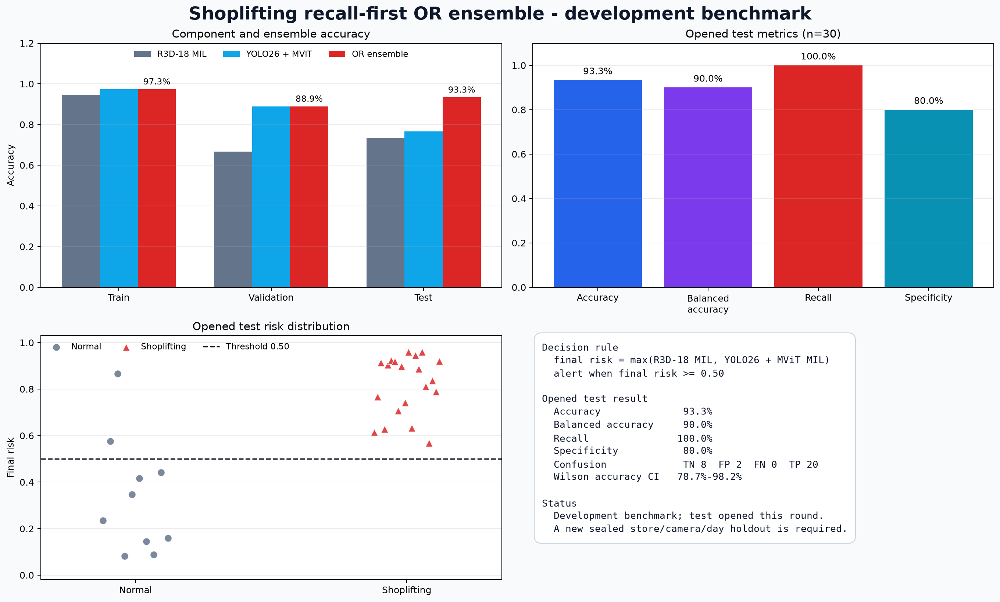
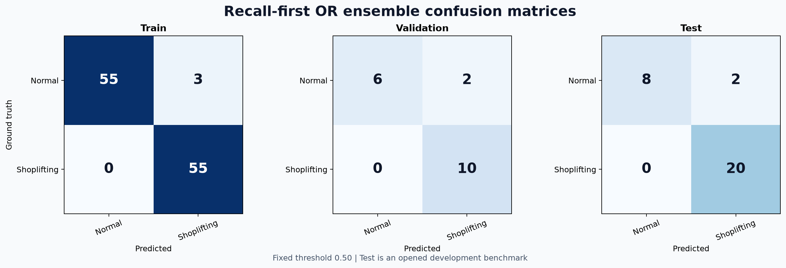
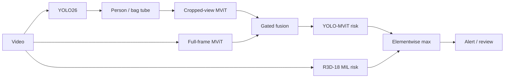

# Shoplifting Recall-First OR Ensemble

Author: Edcosys

Run date: 27 July 2026

## Result

The ensemble takes the elementwise maximum of the R3D-18 MIL and YOLO26-guided MViT MIL video probabilities. This implements a CCTV recall-first OR policy at a fixed 0.50 threshold.

| Split | Videos | Accuracy | Balanced accuracy | Precision | Recall | Specificity | F1 | ROC-AUC |
|---|---:|---:|---:|---:|---:|---:|---:|---:|
| Train | 113 | 97.3% | 97.4% | 94.8% | 100.0% | 94.8% | 97.3% | 99.4% |
| Validation | 18 | 88.9% | 87.5% | 83.3% | 100.0% | 75.0% | 90.9% | 92.5% |
| Opened internal test | 30 | 93.3% | 90.0% | 90.9% | 100.0% | 80.0% | 95.2% | 94.5% |

Opened-test confusion matrix:

| Actual class | Predicted Normal | Predicted Shoplifting |
|---|---:|---:|
| Normal | 8 | 2 |
| Shoplifting | 0 | 20 |

Test accuracy is **93.3%** and recall is **100.0%**. Video-level Wilson 95% intervals are: accuracy 78.7%-98.2%, recall 83.9%-100.0%, specificity 49.0%-94.3%, and precision 72.2%-97.5%.

The class-stratified 4,000-resample bootstrap 95% intervals are: accuracy 83.3%-100.0% and balanced accuracy 75.0%-100.0%.





## Component comparison

| Model | Test accuracy | Test balanced accuracy | Test recall | Test specificity |
|---|---:|---:|---:|---:|
| R3D-18 MIL | 73.3% | 77.5% | 65.0% | 90.0% |
| YOLO26-guided MViT MIL | 76.7% | 77.5% | 75.0% | 80.0% |
| Recall-first OR ensemble | 93.3% | 90.0% | 100.0% | 80.0% |

## Fixed decision rule

```text
final_risk_i = max(r3d18_mil_probability_i, yolo26_mvit_mil_probability_i)
prediction_i = 1 when final_risk_i >= 0.50
```

## Network architecture



The maximum operation is an OR ensemble: either component can raise an alert. This policy prioritizes theft-event recall for CCTV triage and accepts the corresponding false-positive risk.

Each prediction retains both component probabilities, both sets of clip scores, YOLO crop metadata, the dominant component, and the final risk.

## Evaluation status

**The internal test split was opened during this development round. The 93.3% result is a development benchmark, not a sealed final generalization estimate.**

Future validation requires a new sealed store-native holdout grouped by store, camera, day, and incident. It must include hard negatives and report false alerts per camera-hour.

The test set contains 30 videos and correlated recording sessions. The class-stratified bootstrap and video-level Wilson intervals do not account for session correlation.

## Reproduction and provenance

```powershell
.\.venv-yolo\Scripts\python.exe scripts\shoplifting_recall_ensemble.py
```

Input SHA-256 values:

- `r3d_predictions`: `f9060f05cd41a35a946eff82d5cf5d8fcef3d497b937d31a2d9251f1eb64892e`
- `r3d_metrics`: `a196f4c73dc9f51141f58d7678764688a5a73150d8c9798613b6322665e68d44`
- `yolo_mvit_predictions`: `d725bf0bf71eddb64dcf581211029ee90ca65afb73701a9600f1a6cba57db6d2`
- `yolo_mvit_summary`: `9c9cf7030fa8b30693e917a26774e3a3359f6cd6d7eb9acf420e80499d3029df`
- `yolo_mvit_checkpoint`: `a4853852eeeae618f537bc17d73d82961281db3cbf5461f83ffcdb1a0c60e1c4`
- `r3d_checkpoint`: `9924efd1a4c4599857544fdfcbdc0c41a4ae7b3c139c60ec2508dde90b76aba2`

Checkpoint packaging:

- YOLO-MViT: `yolo-mvit-checkpoint.pt`, 5,995,045 bytes, SHA-256 `a4853852eeeae618f537bc17d73d82961281db3cbf5461f83ffcdb1a0c60e1c4`.
- R3D-18 MIL: `../shoplifting/checkpoint.pt`, referenced without duplication.
