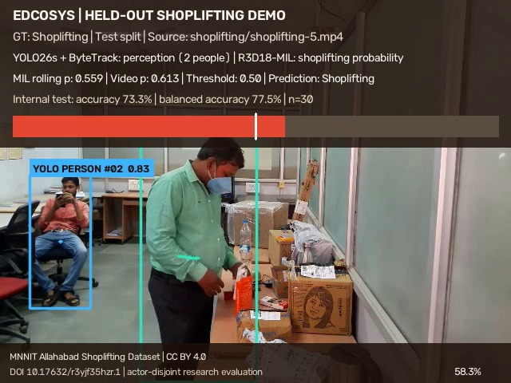
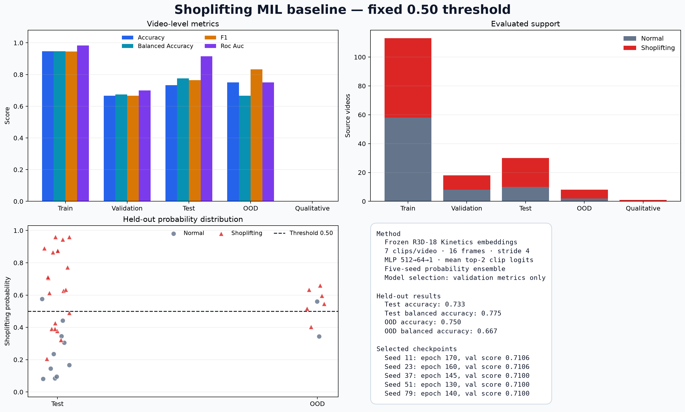
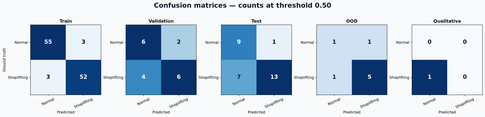

# Shoplifting Video Classification Benchmark

Author: Edcosys
Run date: 27 July 2026

## Result

The benchmark measures complete-video classification on the public MNNIT
Allahabad Shoplifting Dataset. The primary test set keeps the reviewed primary
actors, clothing groups, and connected recording sessions outside training and
validation.

[Watch the held-out H.264 demo](../../../public/assets/video/shoplifting-mil-heldout-demo.mp4).
The demo uses `shoplifting-5.mp4`, selected as the first numeric Shoplifting
video in the internal test manifest before checking its prediction.



| Split | Videos | Accuracy | Balanced accuracy | Precision | Recall | Specificity | F1 | ROC-AUC |
|---|---:|---:|---:|---:|---:|---:|---:|---:|
| Internal actor/clothing holdout | 30 | **73.3%** | **77.5%** | 92.9% | 65.0% | 90.0% | 76.5% | 91.5% |
| New-scene 1920×1080 holdout | 8 | 75.0% | 66.7% | 83.3% | 83.3% | 50.0% | 83.3% | 75.0% |

Internal-test confusion matrix at the fixed 0.50 threshold:

| Actual class | Predicted Normal | Predicted Shoplifting |
|---|---:|---:|
| Normal | 9 | 1 |
| Shoplifting | 7 | 13 |

The 95% stratified-bootstrap interval for internal-test balanced accuracy is
62.5–90.0%; the ROC-AUC interval is 79.0–99.5%. The test set contains 10 Normal and 20 Shoplifting videos, so
balanced accuracy is the primary threshold metric. The majority-class accuracy
baseline on this test split is 66.7%; its balanced accuracy is 50.0%.





## Evaluation protocol

| Split | Normal | Shoplifting | Total | Use |
|---|---:|---:|---:|---|
| Train | 58 | 55 | 113 | Head fitting |
| Validation | 8 | 10 | 18 | Architecture selection and early stopping |
| Internal test | 10 | 20 | 30 | Opened after model selection |
| New-scene OOD | 2 | 6 | 8 | 1920×1080 scene-shift check |
| Qualitative probe | 0 | 1 | 1 | Different laboratory angle |
| Excluded | 12 | 0 | 12 | Exact duplicates, context-only clips, or mixed groups |

The reviewed manifest is
[`actor-clothing-disjoint-split.csv`](actor-clothing-disjoint-split.csv).
Three bit-identical Normal-video duplicates are isolated. Every temporal window
from one source video inherits that video's split.

The source dataset does not provide actor or session IDs. Group assignment was
created by reviewing all clips, primary clothing, co-occurring actors,
recording continuity, resolution, and exact SHA-256 duplicates. Recurring
bystanders and the same laboratory remain across the 640×480 core set.

## Model

- TorchVision R3D-18 with Kinetics-400 pretrained features;
- seven temporal windows per source video;
- 16 frames per window with frame stride 4;
- weakly supervised MLP head, 512 → 64 → 1;
- video score from the mean of the two highest window logits;
- five deterministic training seeds averaged at inference;
- fixed classification threshold of 0.50;
- RTX 4060 Laptop GPU.

The dataset supplies one Normal or Shoplifting label for each complete video.
It has no action start/end time, bounding boxes, person tracks, or product
annotations. YOLO26s and ByteTrack provide the person-perception overlay in the
demo; the reported shoplifting metrics come from the R3D-18 temporal
classifier.

## Interpretation

The internal result supports a warm-start prototype. Seven of 20 Shoplifting
test videos are missed at the 0.50 threshold. The new-scene set contains only
eight videos and produces a wide balanced-accuracy interval, approximately
33.3–100.0%. Store deployment requires a frozen test set from the target
cameras, event-time labels, hard negatives, and false-alerts-per-camera-hour
measurement.

## Reproduction

```powershell
.\.venv-yolo\Scripts\python.exe scripts\create_shoplifting_split_manifest.py
.\.venv-yolo\Scripts\python.exe scripts\shoplifting_mil_baseline.py run
```

Dataset source and attribution:

- Mohd. Aquib Ansari and Dushyant Kumar Singh, *Shoplifting Dataset (2022) -
  CV Laboratory MNNIT Allahabad*, DOI
  [10.17632/r3yjf35hzr.1](https://doi.org/10.17632/r3yjf35hzr.1), CC BY 4.0.
- [Kaggle re-upload](https://www.kaggle.com/datasets/kipshidze/shoplifting-video-dataset).
