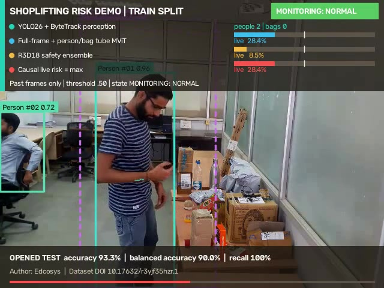
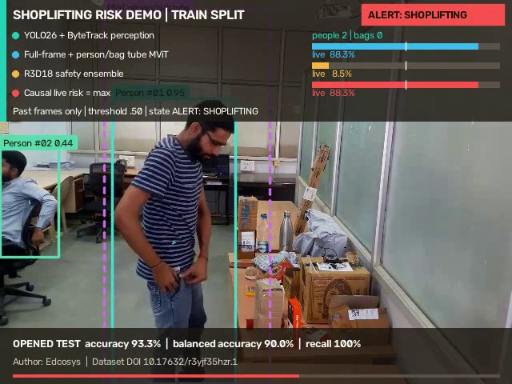

# Shoplifting Decision Video Examples

Author: Edcosys

These videos demonstrate the complete inference display on four clips from
the public Shoplifting Dataset training split. YOLO26s and ByteTrack provide
person and bag perception. The temporal decision combines a full-frame plus
person/bag-tube MViT score with an R3D-18 safety score:

`final risk = max(YOLO26-MViT, R3D-18)`

The fixed alert threshold is 0.50. The live HUD is causal: a window score is
shown only after every frame in that window has been observed. The latest
completed-window score is held until the next result. Full-video aggregation
is recorded in the JSON report and is never inserted into earlier HUD frames.

| Video | Ground truth | Full-video risk | First live alert | Displayed result |
|---|---|---:|---:|---|
| `shoplifting-19-causal-risk.mp4` | Shoplifting | **90.65%** | **5.67 s** | Normal monitoring, then alert during the pocket action |
| `shoplifting-8-risk.mp4` | Shoplifting | **94.49%** | 2.00 s | Clip begins during suspicious handling; alert after first window |
| `normal-6-risk.mp4` | Normal | **4.76%** | None | Monitoring remains normal |
| `shoplifting-1-risk.mp4` | Shoplifting | **93.85%** | 2.00 s | Alert after first completed window |

Before the action threshold (frame 160, 5.33 seconds):

After the next completed temporal window (frame 190, 6.33 seconds):

## Files

- Videos: `public/assets/video/training-risk/`
- Preview images: this directory, `*-preview.jpg`
- Machine-readable validation: this directory, `*-summary.json`
- Renderer: `scripts/render_shoplifting_yolo26_v2_demo.py`

Each video is H.264/yuv420p, 640 x 480, 30 FPS, 325 frames, and 10.83 seconds.
The renderer fully decodes every output and checks dimensions, frame count,
frame rate, finite pixels, and visible motion before writing the validation
summary.

## Evaluation context

These four clips belong to the training split. Their probabilities show what
the trained system displays on selected examples; they are not independent
accuracy measurements. The separate opened 30-video test benchmark achieved
93.3% accuracy, 90.0% balanced accuracy, and 100.0% recall at the same fixed
threshold. A sealed store/camera/day acceptance set remains necessary for a
production generalization claim.

Dataset: Shoplifting Dataset (2022), CV Laboratory MNNIT Allahabad. DOI:
10.17632/r3yjf35hzr.1. License: CC BY 4.0.
